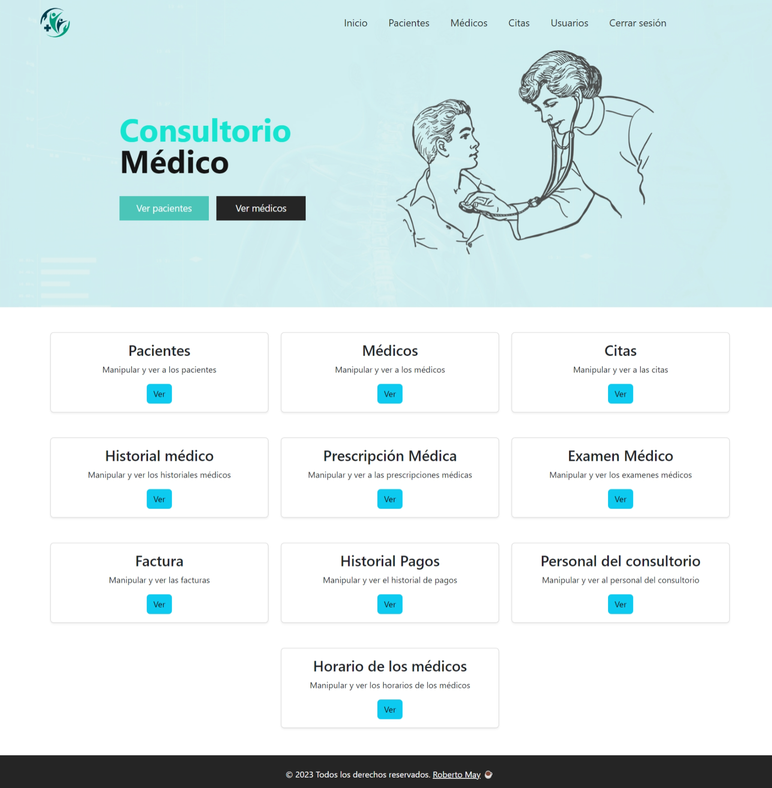

# Consultorio Médico

**Alumno**: Roberto Carlos May Vergara    **Matricula**: 7630   **ISC   5°A**

**Docente**: Dr. Felipe Ángel Álvarez Salgado

**Repositorio del proyecto:** [https://github.com/RobertoMay/Consultorio-Medico](https://github.com/RobertoMay/Consultorio-Medico)

**Repositorio Angular:** [https://github.com/RobertoMay/Consultorio-Medico-Angular](https://github.com/RobertoMay/Consultorio-Medico-Angular)

**Repositorio NestJS:** [https://github.com/RobertoMay/nest-ms-consultorio](https://github.com/RobertoMay/nest-ms-consultorio)

Como parte de la materia de taller de base de datos elabore una aplicación web que utiliza NestJS para el backend, empleando SQL Server como sistema de gestión de base de datos, y Angular para el frontend.

La aplicación tiene como propósito central la gestión integral de datos para un consultorio médico. Entre las entidades manejadas se encuentran pacientes, médicos, citas, personal, entre otros.

**El administrador:** Es el que tiene acceso completo, puede ver, editar y borrar lo que sea además es el único que puede administrar a los usuarios. 

**El médico:** Este solo puede acceder a ciertas tablas, en algunas no puede editar, borrar o agregar solo son de visualización.

**El paciente:** De igual forma tiene permisos limitados ya que en las tablas que tiene acceso son solo de visualización como su historial médico, prescripciones, exámenes médicos, pagos a excepción de sus citas que además de ver también puede solicitar una cita pero no editar o borrar. 

Pagina inicial - vista administrador

Pagina inicial- vista médico

Pagina inicial - vista paciente

Para opciones de prueba se tienen los siguientes usuarios: 

**Administrador**: 

1. Correo: admin1@gmail.com
    
    Contraseña: admin321
    

**Médicos**:

1. Correo: laura@example.com
    
    Contraseña: Gatitos_18
    
2. Correo: armando@gmail.com
    
    Contraseña: armando321
    

**Pacientes**:

1. Correo: falvares@itescam.edu.mx
    
    Contraseña: felipe321
